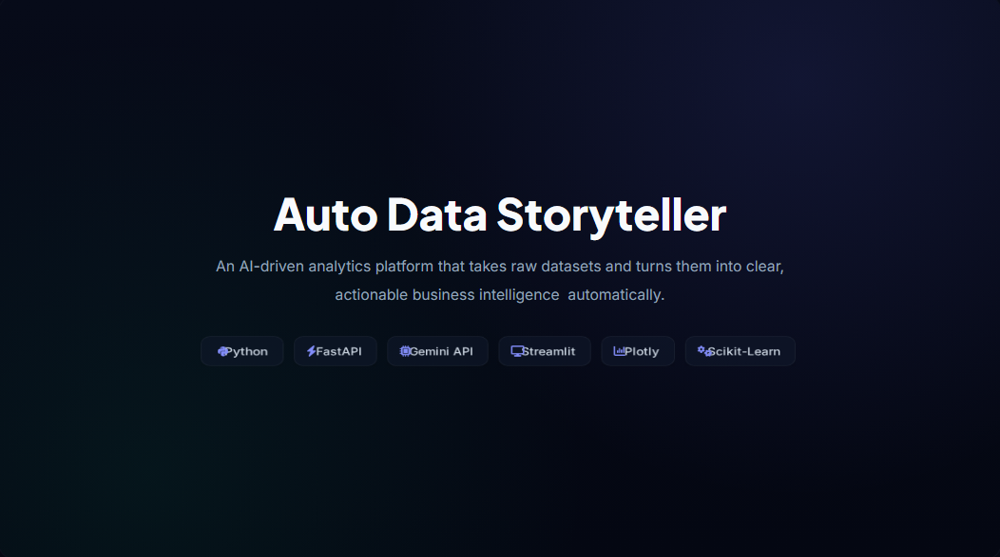

# 🤖 AI Business Analyst

Most data analysis tools stop after training a model. I wanted to build something that goes a step further.

This project takes a dataset, analyzes it, trains a machine learning model, explains the results in plain English, answers follow-up questions, performs natural language analytics, and even generates interactive visualizations from simple English queries.

---

## What it does

Upload a CSV and the application will:

- Clean and preprocess the dataset
- Perform Exploratory Data Analysis (EDA)
- Detect the ML problem type automatically
- Train multiple machine learning models
- Pick the best-performing model
- Generate business-friendly insights using an LLM
- Let you chat with your dataset using RAG
- Execute analytical queries written in plain English
- Create interactive Plotly charts on demand
- Generate a downloadable PDF report

Everything happens inside a single workflow.

---

## Demo

[](https://youtu.be/QFq0L-5y6w4?si=5JaoprXnpiD41y5p)
---

# Features

### 📊 Automated Data Analysis

Instead of manually inspecting the dataset, the application generates:

- Dataset overview
- Missing value analysis
- Statistical summaries
- Data quality insights
- Feature importance
- Business recommendations

---

### 🤖 Machine Learning Pipeline

The ML pipeline automatically:

- Detects regression vs classification
- Preprocesses the dataset
- Trains multiple models
- Evaluates performance
- Selects the best model
- Explains why it was selected

---

### 💬 AI Chat

Once analysis is complete, you can ask questions like:

```
Summarize this dataset.

Why was Random Forest selected?

Explain the feature importance.

What are the key business recommendations?

Explain this as if I were presenting to my manager.
```

The chat uses **RAG (Retrieval-Augmented Generation)**, so responses come from the generated analysis instead of making things up.

---

### 📈 Natural Language Analytics

Instead of writing Pandas code, you can ask:

```
What is the average fare?

Show the maximum age.

Count passengers by gender.

Compare average fare by passenger class.

What is the total fare?
```

The query is converted into structured operations, executed with Pandas, and explained in plain English.

---

### 📉 Dynamic Visualizations

The LLM never writes plotting code.

Instead, it generates a structured chart specification like:

```json
{
  "chart_type": "bar",
  "x": "Pclass",
  "y": "Fare",
  "aggregation": "mean"
}
```

The visualization service converts that specification into an interactive Plotly chart.

Currently supported:

- Bar
- Line
- Scatter
- Histogram

---

### 📄 PDF Report

Generate a report containing:

- Executive summary
- Dataset overview
- EDA findings
- Model performance
- Feature importance
- Recommendations


---

# Tech Stack

**Frontend**

- Streamlit
- Plotly

**Backend**

- FastAPI

**Machine Learning**

- Scikit-learn
- Pandas
- NumPy

**LLM**

- Groq
- Llama 3

**RAG**

- FAISS
- Sentence Transformers

**Visualization**

- Plotly
- Matplotlib

---

# Architecture

```text
                CSV Upload
                     │
                     ▼
            Data Preprocessing
                     │
                     ▼
              Exploratory Data Analysis
                     │
                     ▼
             Machine Learning Pipeline
                     │
                     ▼
            Business Insight Generation
                     │
        ┌────────────┴────────────┐
        │                         │
        ▼                         ▼
   AI Chat (RAG)        Natural Language Analytics
        │                         │
        └────────────┬────────────┘
                     ▼
         Dynamic Plotly Visualizations
                     │
                     ▼
             Streamlit Dashboard
```

---

# Example Questions (of Titanic dataset)

### AI Chat

```
Summarize this dataset.

Explain the model performance.

Why was this model selected?

What are the key business recommendations?

Explain feature importance.
```

### Natural Language Analytics

```
What is the average fare?

Show the highest age.

Compare average fare by passenger class.

Count passengers by gender.

Show the total fare.
```

---

# Rough Edges

Current limitations:

- Only CSV files are supported.
- Natural language analytics currently supports a fixed set of analytical operations.
- The chat is focused on the uploaded dataset rather than being a general-purpose assistant.
- UI is intentionally simple. The focus was on the backend architecture and AI workflow.
- Very large datasets may slow down embedding generation and retrieval.

There are plenty of ideas left for future versions, but I wanted this version to stay focused instead of becoming another endless feature list.

---

# Why I Built This

I wanted a project that combined data science, machine learning, LLMs and RAG into one application instead of treating them as separate demos.

The goal wasn't to build another dashboard. It was to build something that behaves more like an AI analyst that can analyze data, explain its reasoning, answer questions, and help explore a dataset through conversation.

---

## Development

**Developer:** Winner Marvi  
- Backend Development
- Machine Learning
- AI Integration
- RAG
- Natural Language Analytics
- Frontend Development
- Testing & Deployment

**AI Mentor:** ChatGPT (OpenAI)  
- Architecture Guidance
- Technical Mentoring
- Design Reviews
- Code Reviews
- Debugging Assistance

**UI/UX Design:** *(To be added)*

## Author

**Winner Marvi**

If you found the project interesting or useful, consider giving it a ⭐.